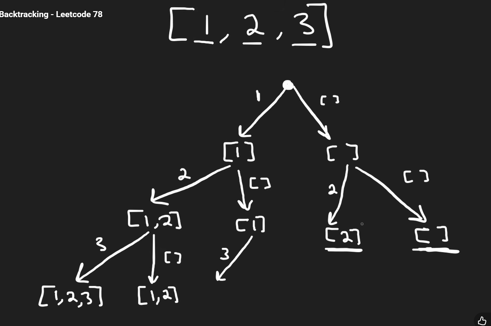
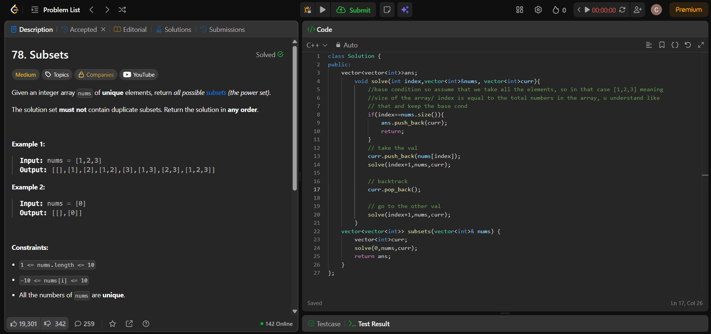

# basics of how it woks
so fistly,we have a choice to take the 1,or not take the 1, so we have 2 paths,then next is should we take 2 or shold we not take 2, like that it forms a tree

# time complexity 

so we have 2 x 2 x 2 choices, or **2^n** choices which is the number of subsets

worst case complexity is O(n.2^n) time complexity



This is how the tree will look like


Here it shows the final tree, how it will look, in the end we will jave 8 subsets
# Solution



read the info in the pic enough

base condition so assume that we take all the elements, so in that case [1,2,3] meaning
size of the array/ index is equal to the total numbers in the array, u understand like
 that and keep the base cond

```cpp
 class Solution {
public:
    vector<vector<int>>ans;
        void solve(int index,vector<int>&nums, vector<int>curr){
            //base condition so assume that we take all the elements, so in that case [1,2,3] meaning
            //size of the array/ index is equal to the total numbers in the array, u understand like
            // that and keep the base cond
            if(index==nums.size()){
                ans.push_back(curr);
                return;
            }
            // take the val
            curr.push_back(nums[index]);
            solve(index+1,nums,curr);

            // backtrack
            curr.pop_back();

            // go to the other val
            solve(index+1,nums,curr);
        }
    vector<vector<int>> subsets(vector<int>& nums) {
        vector<int>curr;
        solve(0,nums,curr);
        return ans;
    }
};
```