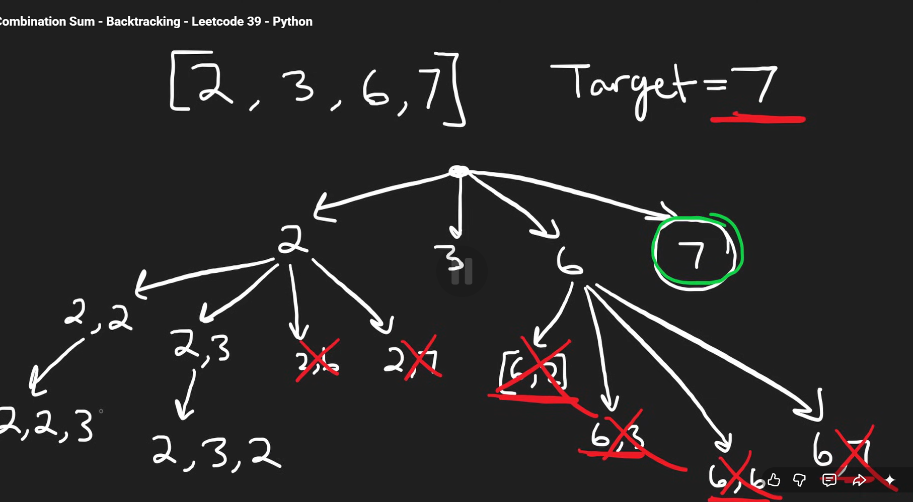
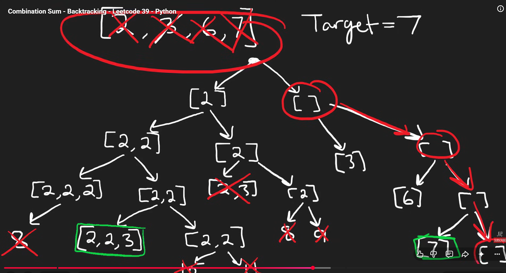
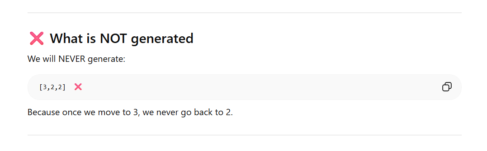
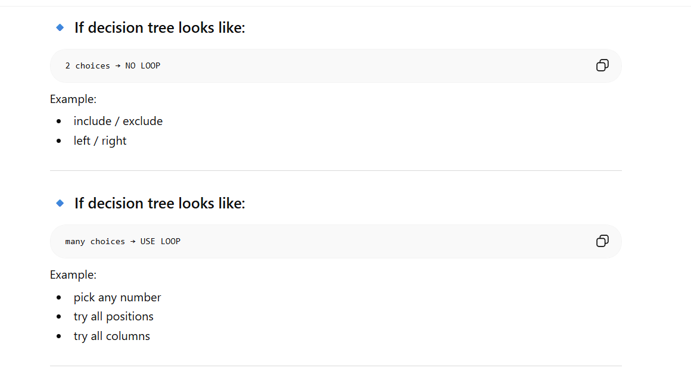
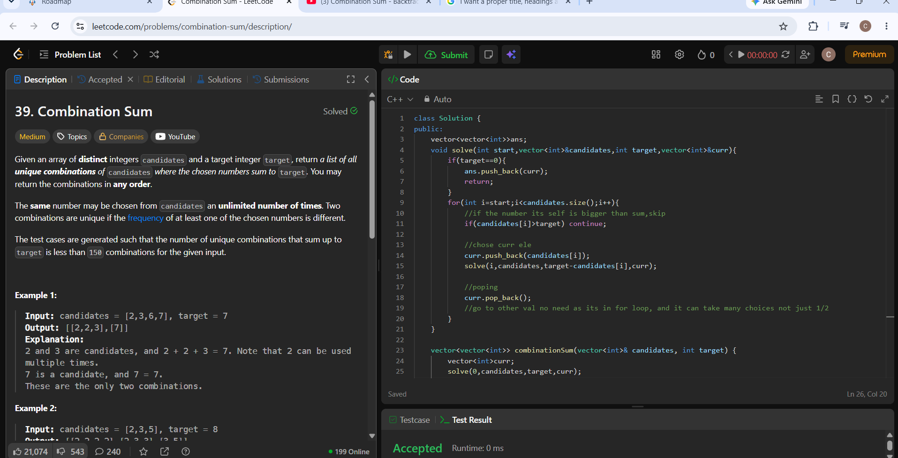

# Solution

So here the main problem is the duplicates, as they dont want duplicate solutions


This is somewhat of how the tree will be like, so if we see number 6, any sum you do will have the value greater than 7 so no need to continue in that branch like that



## just do backstracking ashte



# important
your doubt like, if we go to 3, why dont we again pick 2 and 2 and get duplicates well the answer is if we start with 3, you never go back to the previous numbers so backstracking automatically takes care of duplicates


# code



so if we are using for loop its different, we use it when there is mulltiple choices, not just between 2, hence in the end **we do not use the backstracking** step, instead we keep the whole thing in a **for** loop and when popped, it goes back to the for loop (in the next recursive call) and can chose between mulltiple values

# code

```cpp
class Solution {
public:
    vector<vector<int>>ans;
    void solve(int start,vector<int>&candidates,int target,vector<int>&curr){
        if(target==0){
            ans.push_back(curr);
            return;
        }
        for(int i=start;i<candidates.size();i++){
            //if the number its self is bigger than sum,skip
            if(candidates[i]>target) continue;

            //chose curr ele
            curr.push_back(candidates[i]);
            solve(i,candidates,target-candidates[i],curr);

            //poping
            curr.pop_back();
            //go to other val no need as its in for loop, and it can take many choices not just 1/2
        }
    }
    
    vector<vector<int>> combinationSum(vector<int>& candidates, int target) {
        vector<int>curr;
        solve(0,candidates,target,curr);
        return ans;
    }
};
```