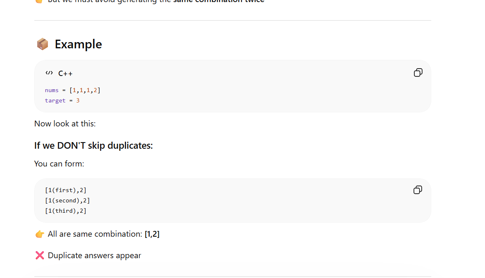
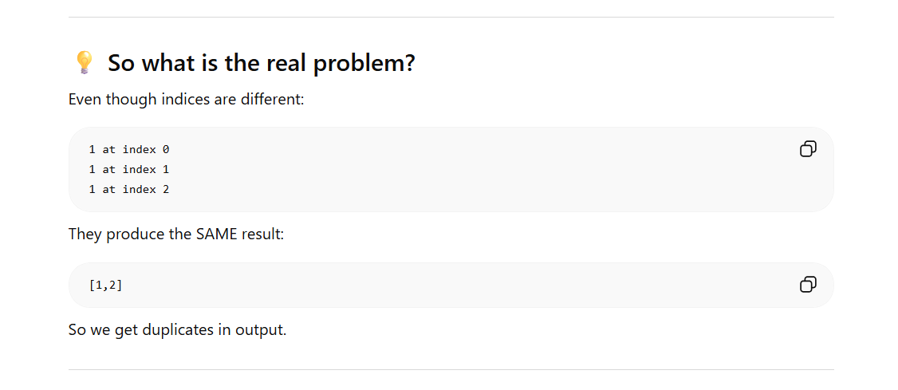
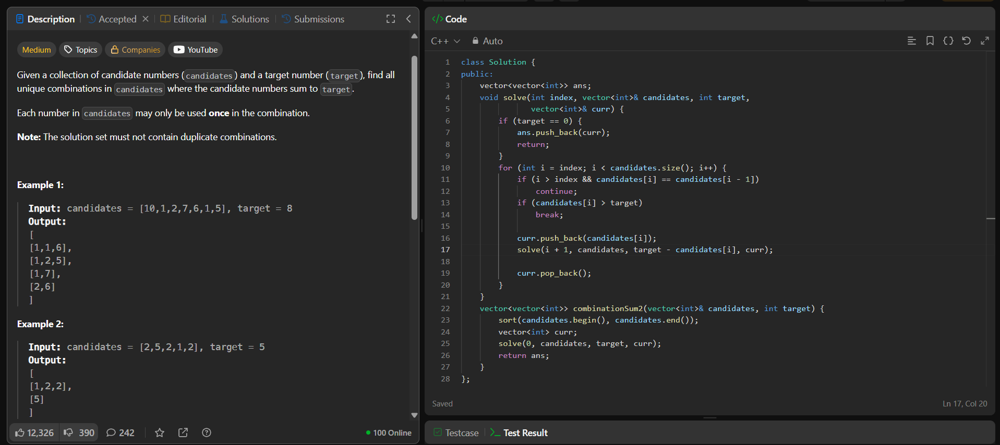

# Solution

Here also you use a **for** loop, why? as you are **selecting one number from mulltiple options**

## difference from one and two 

in the previous question, reusing was allowes,so wafter u selected the element, you stayed in the same element, 

```
solve(i, target - nums[i])
```
 but in this questions its not allowed to reuse same index/number hence-

```
solve(i+1, target - nums[i])
```
# main problem



so if we have repeated numbers in the array, it produces same duplicate answers, so to avoid that we check if the element which is going to be added if its in the array after the element, and based on that we continue
```
if (i > start && nums[i] == nums[i - 1]) continue;
```

# Code


```cpp
class Solution {
public:
    vector<vector<int>> ans;
    void solve(int index, vector<int>& candidates, int target,
               vector<int>& curr) {
        if (target == 0) {
            ans.push_back(curr);
            return;
        }
        for (int i = index; i < candidates.size(); i++) {
            // checking for duplicates
            if (i > index && candidates[i] == candidates[i - 1])
                continue;
            // we break instead of continueing, as we sort the array
            if (candidates[i] > target)
                break;

            // backstracking steps
            curr.push_back(candidates[i]);
            solve(i + 1, candidates, target - candidates[i], curr);

            curr.pop_back();
        }
    }
    vector<vector<int>> combinationSum2(vector<int>& candidates, int target) {
        sort(candidates.begin(), candidates.end());
        vector<int> curr;
        solve(0, candidates, target, curr);
        return ans;
    }
};
```