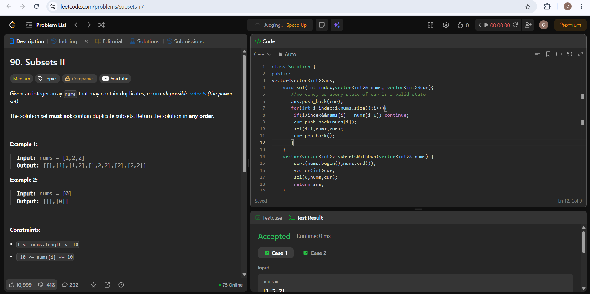

```cpp
class Solution {
public:
vector<vector<int>>ans;
    void sol(int index,vector<int>& nums, vector<int>&cur){
       //no condition, as every state of cur is a valid state
       ans.push_back(cur);
       for(int i=index;i<nums.size();i++){
        // so that no duplicates in final ans
        if(i>index&&nums[i] ==nums[i-1]) continue;
        cur.push_back(nums[i]);
        sol(i+1,nums,cur);
        cur.pop_back();
       }
    }
    vector<vector<int>> subsetsWithDup(vector<int>& nums) {
        sort(nums.begin(),nums.end());
        vector<int>cur;
        sol(0,nums,cur);
        return ans;
    }
};
```