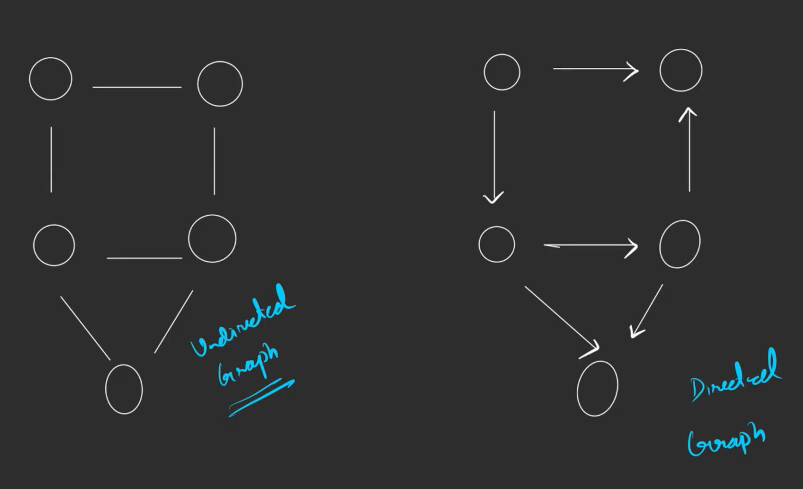
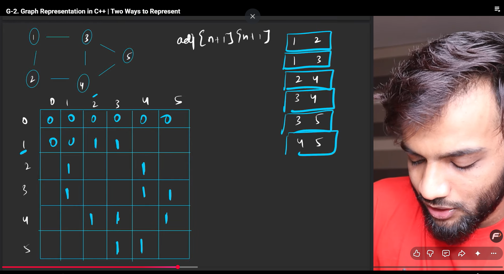
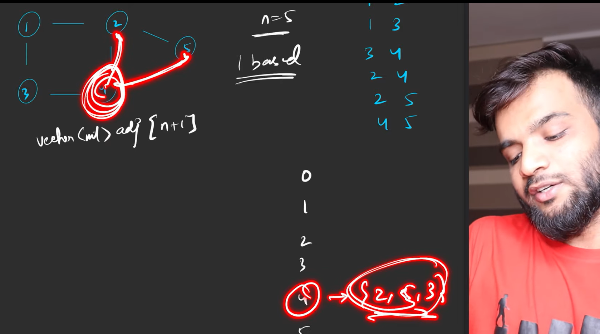
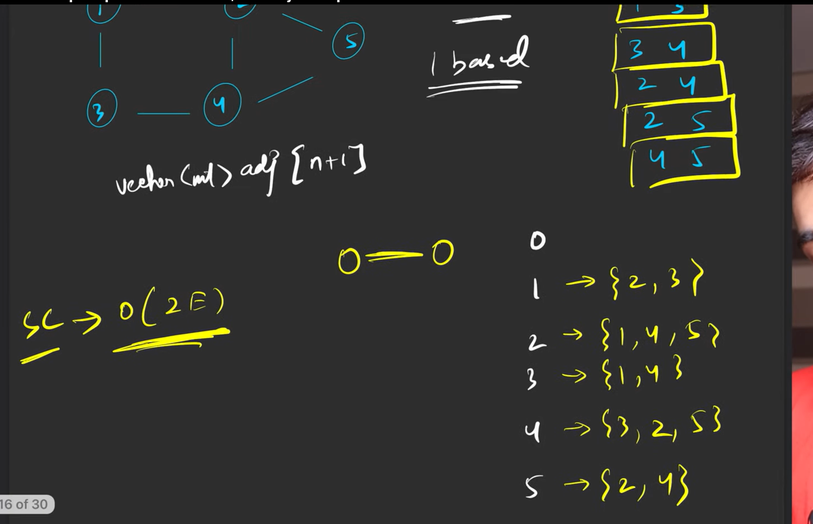
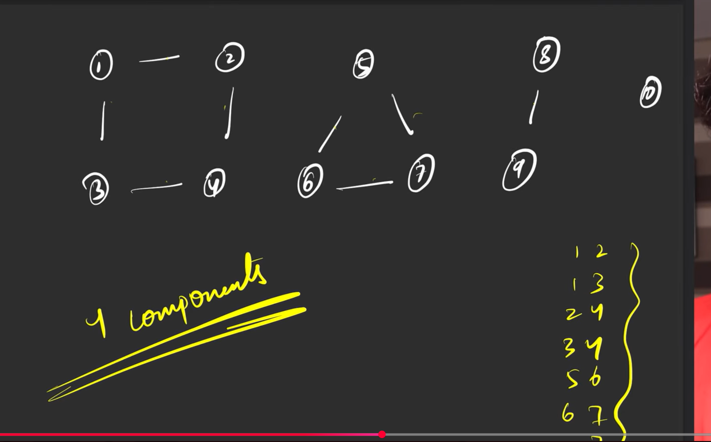
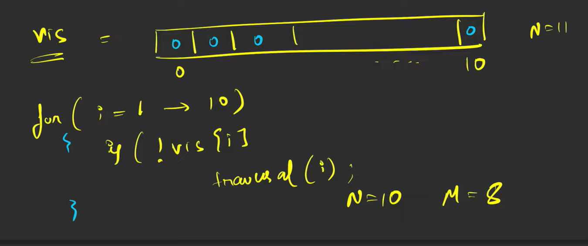
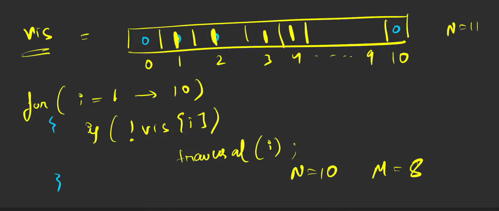

# Basics


### path-> a node cannot appear twice in a path



How to represent undirected graph
so here the 1, is from the path, if 2-3 u mark
2,3 and 3,2 in the martix with 1, and the remaining u mark as 0

```cpp
#include<iostream>
using namespace std;

int main(){
    int n,m;
    cin>>n>>m;
    int adj[n+1][m+1];
    for(int i=0;i<m;i++){
        int u,v;
        cin>>u>>v;
        adj[u][v]=1;
        adj[v][u]=1;

    }
}
```
This takes n^2 space

### so instead we use **Adjasency** list


so we say that with the list, if we have 4 and it has 2,5,3, we can say that it has a edge from 4 to 2 and 5 and 3

space complexity is O(2E), as we have 6 edges, but stored 12 numbers in the end

```cpp

int main(){
    int n, m;
    cin>>n>>m;
    vector<int>adj[n+1];
    for(int i=0;i<m;i++){
        int u,v;
        cin>>u>>v;
        adj[u].push_back(v);
        adj[v].push_back(u);
    }
}
```

## Directed graph

Now we stored both edges in undirected for directed you just store one

so instead of 

        adj[u].push_back(v);
        adj[v].push_back(u);

you just do

        adj[u].push_back(v);
        //adj[v].push_back(u);


## weighted grah

for this, instead of putting 1 in the **matrix**, just put the actual weight, 

        adj[u][v] = weight

for **adjasency list** you store it as pairs so->

        before
        4-> {2,3,5}
        With weights
        4->{(2,3),(5,6)}

here 2 is the node, 3 is the weight associated with it.
## Connected components between mulltiple graphs


here you want to join or use all the graphs, so what we do is we use a **visited array**, of size 11(10+1)

we start like this, so the first condition here, it is false, so it **traversal(1)** occurs

when that happens its in the first graph, and the whole graph it traversed, and the array becomes 


Now when we do i=2, its already traversed dont do anything, now when you go to 5, its not traversed(marked as 0 in the array), so you go to that graph and mark those numbers in the array as 1 thats all