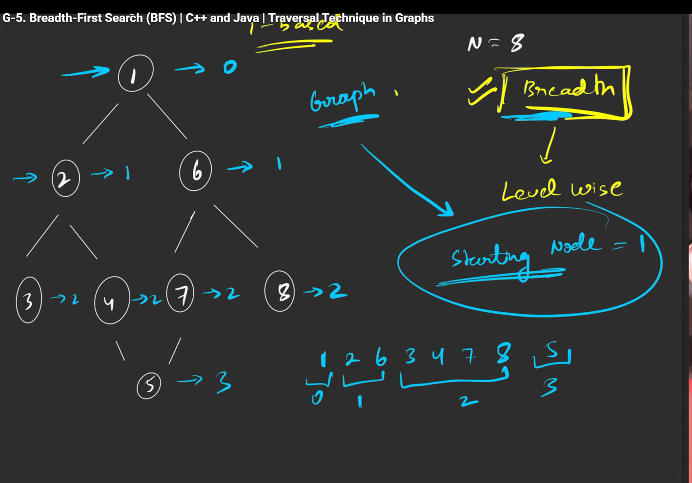
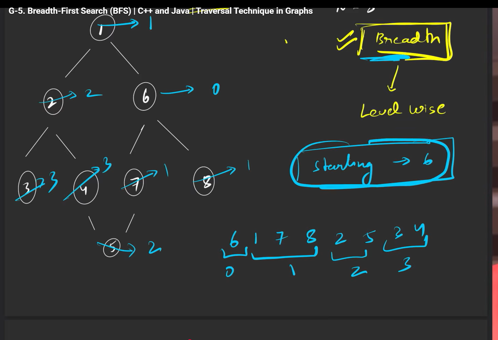
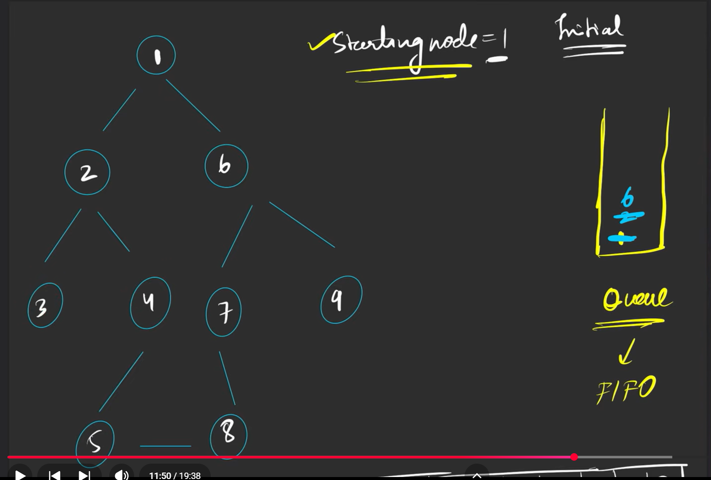
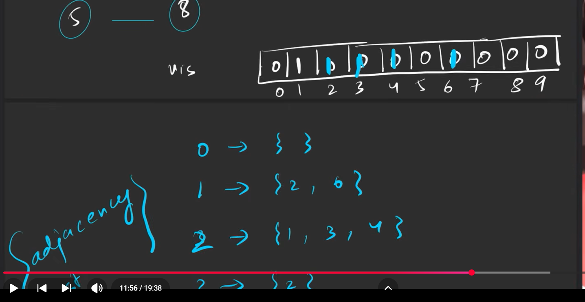

# BFS


Here its like level order traversal only
that is if the starting node is 1, 



if your starting node is 6
 # logic

 so you take a queue, and a visited array
  
  so in graphs, we stored the data using adjasency list, so first initally put the the root node in the queue, and mark the visited array as 1

  then what you do is you push the elements from the adjasency list of 1, which are 2 and 6

  you mark them 1 in the visited list, and push them in the queue,

  next you take 2, and push those values which are 1,3,4 but 1 is  already marked in the adjasency list, do dont push that in Q, push only 3 and 4 and mark them in the visited array 
  

  ```cpp
class Solution { 
public: 
    vector<int> bfsOfGraph(int v, vector<int> adj[]) { 
        vector<int> vis(v, 0); 
        vis[0] = 1; 
        
        queue<int> q; 
        q.push(0); 
        
        vector<int> bfs; 
        
        while(!q.empty()){ 
            int node = q.front(); 
            q.pop(); 
            bfs.push_back(node); 
            
            for(auto it : adj[node]){ 
                if(!vis[it]){ 
                    vis[it] = 1; 
                    q.push(it); 
                } 
            } 
        } 
        return bfs; 
    } 
};
```