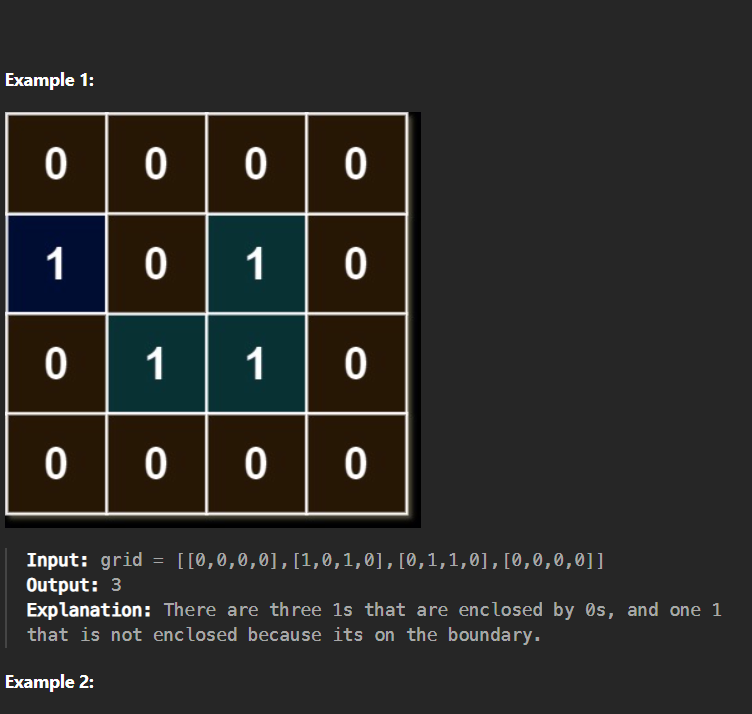

# solution
problem 1020

so what we did in prev q is find the boundry nodes, and did not consider them, in this question also same thing but addition is that you u shld print the total number of 1's which are not converted to 0's asthe



we use bfs here, previous questions we did dfs, so here we will find the nodes which cant be encloeds, and put them in vis array, and then in the end just loop through the vis array, and incremenet a counter to verify if its a 1 and its not included in vis array, then increment

```cpp
class Solution {
public:
    int numEnclaves(vector<vector<int>>& grid) {
        queue<pair<int,int>> q;
        int n=grid.size();
        int m=grid[0].size();
        vector<vector<int>> vis(n,vector<int>(m,0));
        for(int i=0;i<n;i++){
            if(grid[i][0]==1){
                vis[i][0]=1;
                q.push({i,0});  
            }  
            if(grid[i][m-1]==1){
                vis[i][m-1]=1;
                q.push({i,m-1});
            }
        }
        for(int j=0;j<m;j++){
            if(grid[0][j]==1){
                vis[0][j]=1;
                q.push({0,j});
            }
            if(grid[n-1][j]==1){
                vis[n-1][j]=1;
                q.push({n-1,j});
            }
        }
        vector<int>delrow={-1,0,+1,0};
        vector<int>delcol={0,+1,0,-1};
        while(!q.empty()){
            int r=q.front().first;
            int c=q.front().second;
            q.pop();
            for(int i=0;i<4;i++){
                int nr=r+delrow[i];
                int nc=c+delcol[i];
                if(nr>=0&&nr<n&&nc>=0&&nc<m&&!vis[nr][nc]&&grid[nr][nc]==1){
                    q.push({nr,nc});
                    vis[nr][nc]=1;
                }
            }
        }
        int cnt=0;
        for(int i=0;i<n;i++){
            for(int j=0;j<m;j++){
                if(grid[i][j]==1 && vis[i][j]==0){
                    cnt++;
                }
            }
        }
        return cnt;
    }
};
```