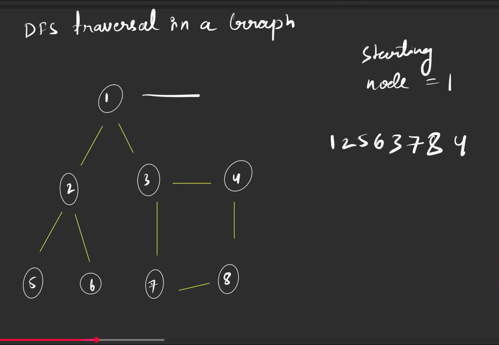
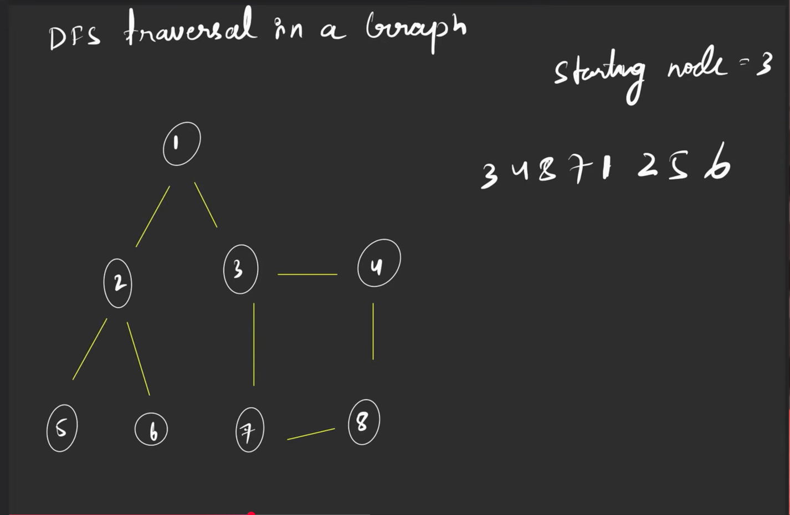
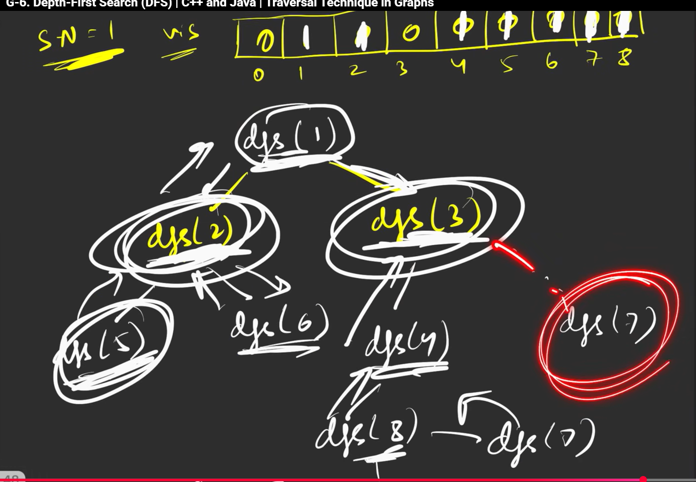

# Depth first search


you can go in any order, you could of gone, form 1-3-7-8-9-2-5-6 or the order in the img above  

   
you'll basically do it using recursion, kind of like backstracking

how the recursive tree looks like
```cpp

class Solution { 
    private:
    void dfs(int node,vector<int>adj[],vector<int>vis,vector<int>&ls){
        vis[node]=1;
        ls.push_back(node);
        //traverse all the neighbours
        for(auto it:adj[node]){
            if(!vis[it]){
                dfs(it,adj,vis,ls);
            }
        }
    }
public: 
    vector<int> dfsOfGraph(int v, vector<int> adj[]) { 
         vector<int>vis(v,0);
         int start=0;
        vector<int>ls;
    } 
};

```
# complexity
it is O(n) for space complexity

2 x E as its the sum of edges, and O(n), as for every every node u call the functoin once

tc- O(n) + 2 x E = (N+ 2E) they take n as v 

for directed the 2 will go, and become O(V+E)