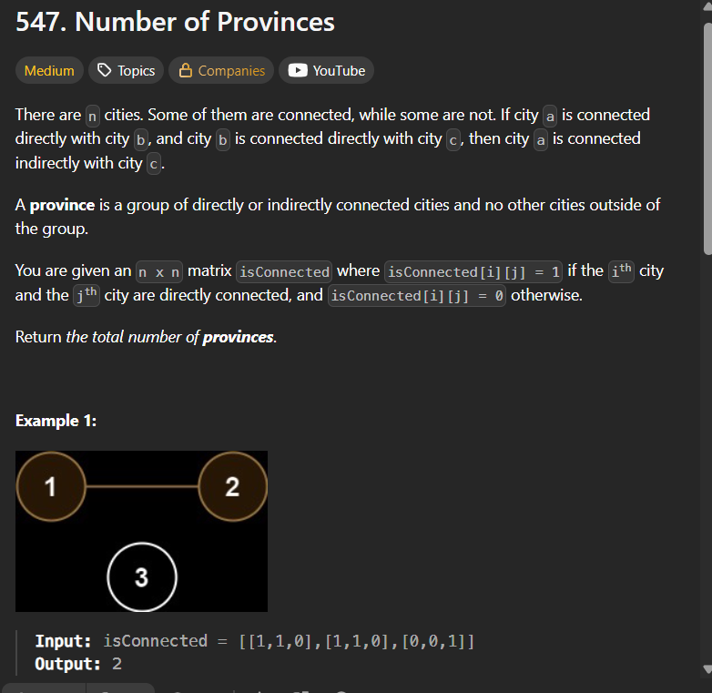
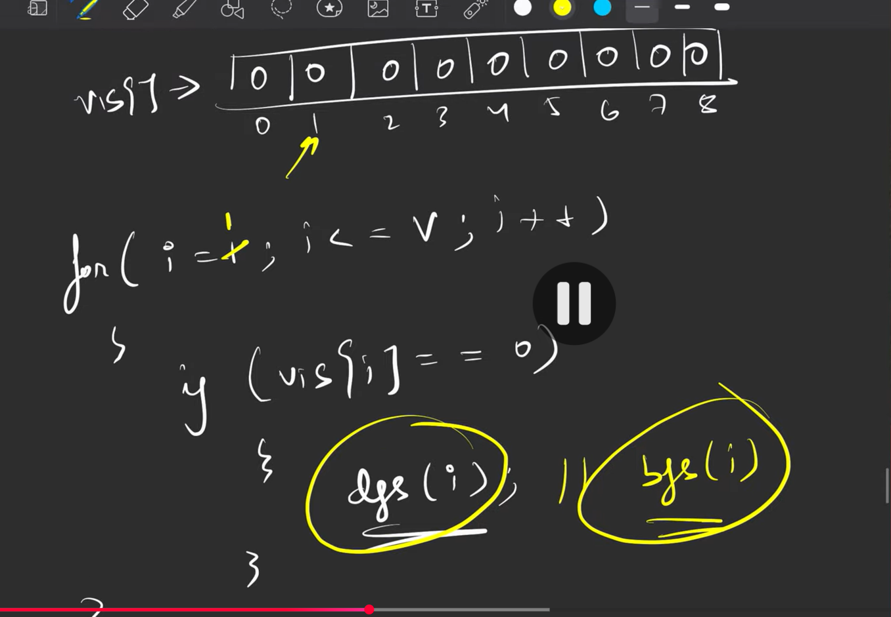

# solution
basically in this questoin you should find the graphs


so here to identify the total number of graphs we can either use dfs or bfs, but the point is that ,we need to keep track of total number of graphs visited

so what we do is we use teh visited array right, we will find one graph using only one of the element as usual, and iterate through the array till we find a path not marked, and we do dfs/bfs on that point, see the img

so here we start with the 1 index, which is 0, in the loop its 0, so it does dfs, and **marks 1,2,3 as visited**. then we iterate the array, and use the graph, and just put one **counter** before writing dfs, or after, to check how many times it ran so that u can get to know the total number of graphs

``` cpp
class Solution {
public:
    void dfs(int node, vector<vector<int>>& adj, vector<int>& vis) {
        vis[node] = 1;

        for (auto it : adj[node]) {
            if (!vis[it]) {
                dfs(it, adj, vis);
            }
        }
    }

    int findCircleNum(vector<vector<int>>& isConnected) {
        int v = isConnected.size();

        vector<vector<int>> adj(v);

        // convert adjacency matrix to list
        for (int i = 0; i < v; i++) {
            for (int j = 0; j < v; j++) {
                if (isConnected[i][j] == 1 && i != j) {
                    // you can do adj[j].push_back(i), but it will cause replication
                    adj[i].push_back(j);
                }
            }
        }

        vector<int> vis(v, 0);
        int cnt = 0;

        for (int i = 0; i < v; i++) {
            if (!vis[i]) {
                // incrementing here
                cnt++;
                dfs(i, adj, vis);
            }
        }

        return cnt;
    }
};
```

Here we convert the given input from matrix form to adjasency list and then do it normally
## this is directly using the matrix
```cpp
class Solution {
public:
    void dfs(int node, vector<vector<int>>& isConnected, vector<int>& vis) {
        vis[node] = 1;

        int n = isConnected.size();

        for (int j = 0; j < n; j++) {
            if (isConnected[node][j] == 1 && !vis[j]) {
                dfs(j, isConnected, vis);
            }
        }
    }

    int findCircleNum(vector<vector<int>>& isConnected) {
        int n = isConnected.size();
        vector<int> vis(n, 0);

        int cnt = 0;

        for (int i = 0; i < n; i++) {
            if (!vis[i]) {
                cnt++;
                dfs(i, isConnected, vis);
            }
        }

        return cnt;
    }
};
```