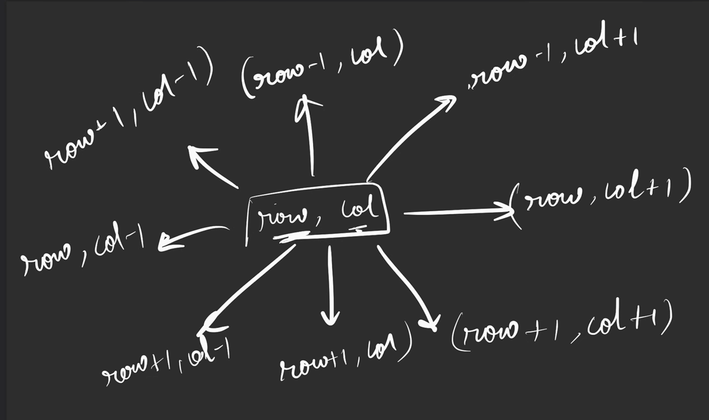

# solution

asked in interview 

Here you need to find the number of islands aka graph in the 2-d matrix asthe

so this time we will do it using bfs, and we dont convert to adjasency list, 

so what we do is to start the graph ka node, we use 2 for loops to iterate, and its it 0 in the visited array, we start bfs on that node and increment a counter asthe

### For the visited node, we will have to store it in a 2-d matrix, as the input is in 2-d matrix 

we store the visited array like this using     
```cpp
    vector<vector<int>> vis(n,vector<int>(m, 0)); 
```
```
vis =
[
  [0, 0, 0, ..., 0],
  [0, 0, 0, ..., 0],
  ...
  (n rows)
]
```
### for each island or node, to check if the adjasent has a value of 1, we haeve to check 8 sides, so trick is below to check the 8 sides to mark in bfs


so just make 2 for loops, and make them go from -1 to 1, asthe

```cpp
class Solution {
public:
    void bfs(int row, int col, vector<vector<int>>& vis, vector<vector<char>>& grid) {
        int n = grid.size();
        int m = grid[0].size();

        vis[row][col] = 1;
        queue<pair<int,int>> q;
        q.push({row, col});

        while (!q.empty()) {
            int r = q.front().first;
            int c = q.front().second;
            q.pop();

            for (int delrow = -1; delrow <= 1; delrow++) {
                for (int delcol = -1; delcol <= 1; delcol++) {

                    // skip diagonal + self if you want 4-direction movement (IMPORTANT) doing only 
                    // 4 directions instead of 8
                    if (abs(delrow) + abs(delcol) != 1) continue;

                    int nrow = r + delrow;
                    int ncol = c + delcol;

                    if (nrow >= 0 && nrow < n &&
                        ncol >= 0 && ncol < m &&
                        grid[nrow][ncol] == '1' &&
                        !vis[nrow][ncol]) {

                        vis[nrow][ncol] = 1;
                        q.push({nrow, ncol});
                    }
                }
            }
        }
    }

    int numIslands(vector<vector<char>>& grid) {
        int n = grid.size();
        int m = grid[0].size();

        vector<vector<int>> vis(n, vector<int>(m, 0));

        int cnt = 0;

        for (int row = 0; row < n; row++) {
            for (int col = 0; col < m; col++) {

                if (!vis[row][col] && grid[row][col] == '1') {
                    cnt++;
                    bfs(row, col, vis, grid);
                }
            }
        }

        return cnt;
    }
};
```