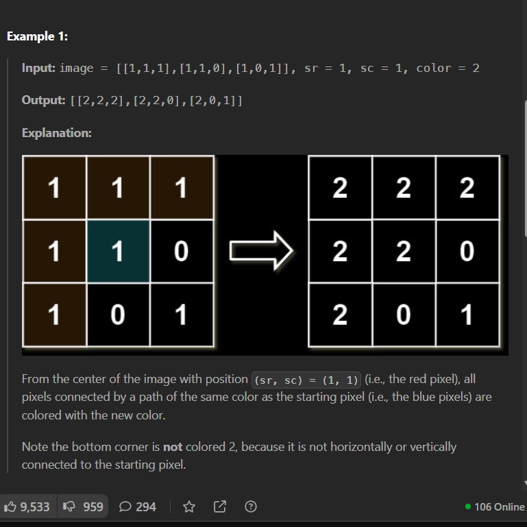
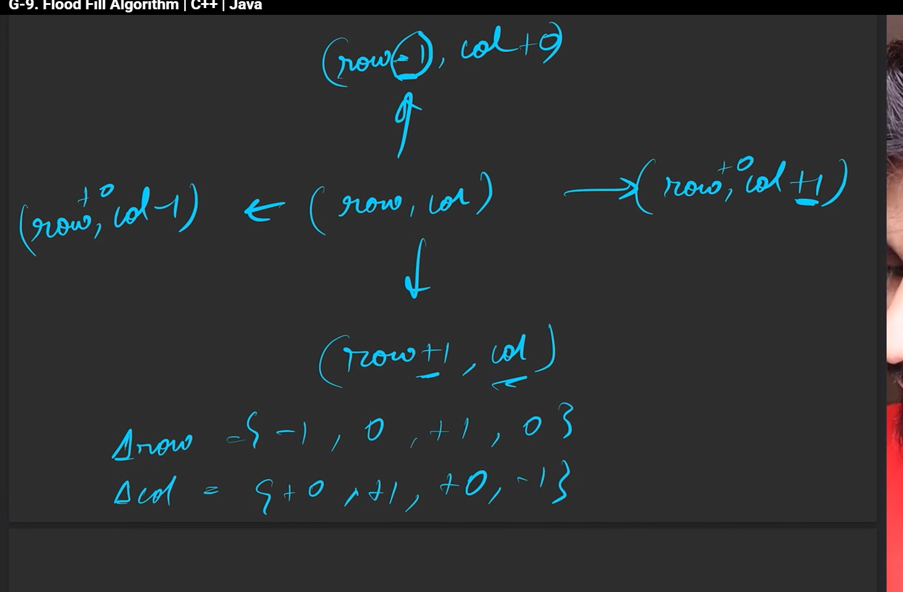

# solutoin


```cpp

class Solution {
private:
    void dfs(int row, int col, vector<vector<int>>& ans,
             vector<vector<int>>& img, int newcolor,int inicolor,vector<int> delrow,vector<int> delcol) {
        ans[row][col] = newcolor;
        // now checking for neighbour
        int n=img.size();
        int m=img[0].size();
        for(int i=0;i<4;i++){
            int nrow=row+delrow[i];
            int ncol=col+delcol[i];
            if(nrow>=0&&nrow<n&&ncol>=0&&ncol<m&&
            img[nrow][ncol]== inicolor
            &&ans[nrow][ncol]!=newcolor){
                dfs(nrow,ncol,ans,img,newcolor,inicolor,delrow,delcol);
            }
        }
    }

public:
    vector<vector<int>> floodFill(vector<vector<int>>& image, int sr, int sc,
                                  int color) {
        int inicolor = image[sr][sc];
        vector<vector<int>>& ans = image;
        vector<int> delrow = {-1, 0, +1, 0};
        vector<int> delcol = {0, +1, 0, -1};
        dfs(sr, sc, ans, image, color,inicolor,delrow,delcol);
        return ans;
    }
};
```
so here same as the previous question but in dfs, here we check for 4 directions, hence we wrote those numbers, 


Here you see how to get the numbers, start from the top, and go clock wise, so for row we first do -1,0,+1,0 so make that as delrow

for delcol also same, first we do 0,+1,0,-1, that becomes delcol asthe bro 

then the remaining is the question ka logic, where they told only change the numbers of those that have the same inital value etc, go through question

main part is also the conditions for dfs, go through that