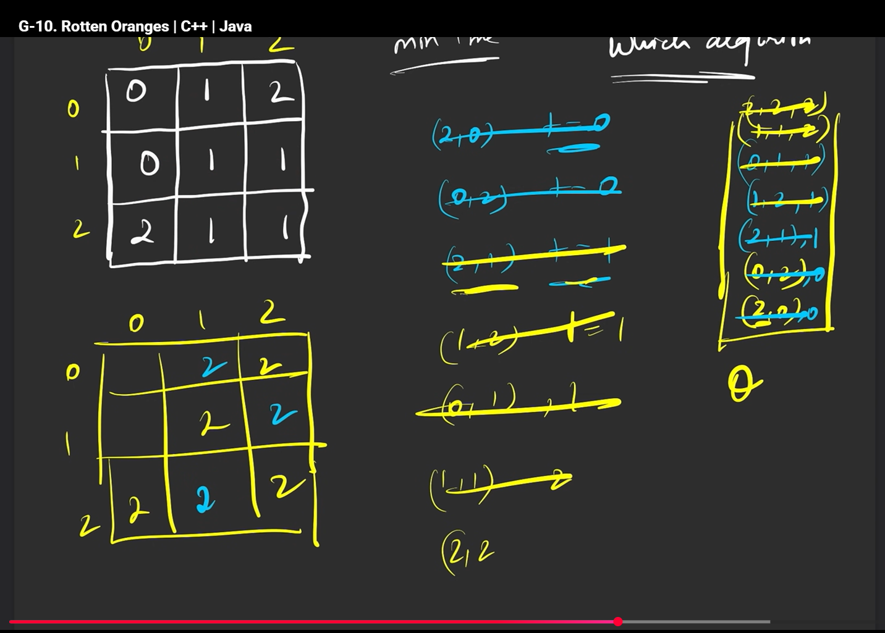

# solution
So here we use bfs


we can have mulltiple start points, so using all of the starting points, we need to find the time it takes to convert all the 1's to 2, if its not possible to reach all the 1's return -1

so here we store 3 things in the queue, {{row,col}time} as we can have mulltiple starting points, we initally push them as time 0, and every time they iterate increament the time, so in time 1, we would have {(2,1),1} , {(1,2),1} like that bfs u do asthe

```cpp
    class Solution {
public:
    int orangesRotting(vector<vector<int>>& grid) {
        int n = grid.size();
        int m = grid[0].size();

        queue<pair<pair<int,int>,int>> q;
        vector<vector<int>> vis(n, vector<int>(m,0));

        int fresh = 0;

        for(int i = 0; i < n; i++) {
            for(int j = 0; j < m; j++) {
                if(grid[i][j] == 2) {
                    q.push({{i,j},0});
                    vis[i][j] = 2;
                }
                else if(grid[i][j] == 1) {
                    fresh++;   // 🔥 count fresh oranges
                }
            }
        }

        int time = 0;

        vector<int> delrow = {-1,0,1,0};
        vector<int> delcol = {0,1,0,-1};

        while(!q.empty()) {
            int r = q.front().first.first;
            int c = q.front().first.second;
            int t = q.front().second;
            q.pop();

            time = max(time, t);

            for(int i = 0; i < 4; i++) {
                int nrow = r + delrow[i];
                int ncol = c + delcol[i];

                if(nrow >= 0 && nrow < n && ncol >= 0 && ncol < m &&
                   vis[nrow][ncol] != 2 && grid[nrow][ncol] == 1) {

                    q.push({{nrow,ncol}, t + 1});
                    vis[nrow][ncol] = 2;
                    fresh--;   // 🔥 reduce fresh when infected
                }
            }
        }

        // 🔥 FINAL CHECK (THIS FIXES YOUR BUG)
        return fresh == 0 ? time : -1;
    }
};
```

# imp 
so what we do over here, to check if it has visited all the fresh oranges, we have a counter int he first, of all the fresh oranges, and every time we infect a orange we decrease it, and if its equal to 0 all are infected or else they arent;