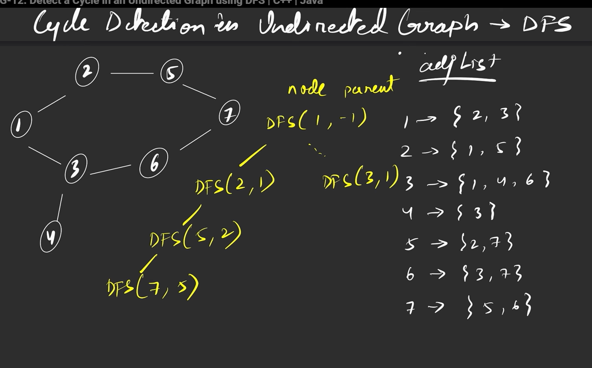
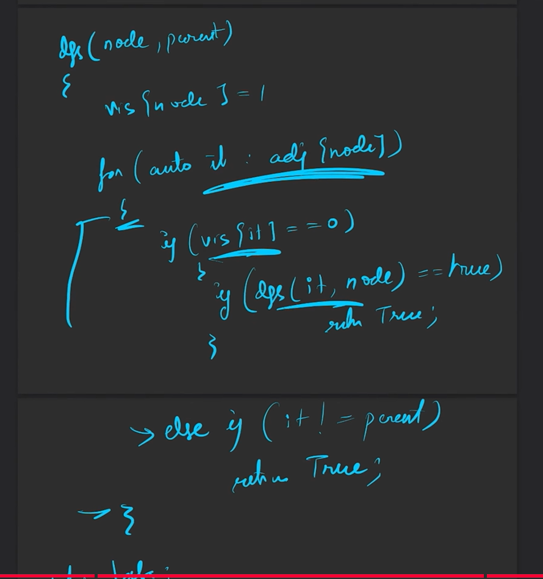

# solution
take a visietd array, 

so here, we have the recursion, the thing is when the adj list is there, it goes based on the list, now questoin comes, why dont we go back to the parent node as its in the list, and say cycle is there, 

hence we have to store a parent node, so that we can check that if its the** praent ignore**

psudo code

so here the second case, is the cycle detected at that point, and since its recursion, and it shuld return true in every chain and finally to the final answer, we do that first case so it returns true to all the recursive calls 

```cpp
class Solution {
	public:
	bool dfs(int node, int parent, vector<int>&vis, vector<vector<int>> &adj) {
		vis[node] = 1;
		for (auto adjnode: adj[node]) {
			if (!vis[adjnode]) {
				if (dfs(adjnode, node, vis, adj) == true)
					return true;
			} // below is, visited, but not parent, meaning cycle at the point is found
			else if (adjnode != parent) {
				return true;
			}
		}
		return false;
		
	}
	bool isCycle(int V, vector<vector<int>> & edges) {
		// Code here
		vector<vector<int>> adj(V);
		
		for (auto it : edges) {
			int u = it[0];
			int v = it[1];
			
			adj[u].push_back(v);
			adj[v].push_back(u);
		}
		vector<int>vis(V, 0);
		for (int i = 0; i<V; i++) {
			if (!vis[i]) {
				if (dfs(i, -1, vis, adj) == true)
					return true;
			}
		}
		return false;
		
	}
};
```