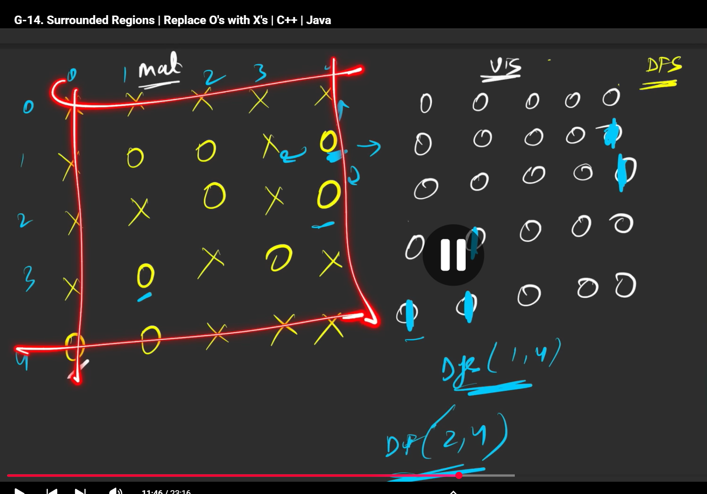

# solution

So here the question is the group of 0's which is connected the bottom, top,left, right should be 1's

so the thing is, the boundry 0's, their left or right or top or bottom will be null, no number, hence if we find those boundry 0's and mark them as 1 in the visited matrix, we can just put the remaining numbers in the matrix(the unvisited ones) as x and return asthe

for the boundry 0's we should do the dfs as the whole group will not be considered and hence you'll have to mark those also as 1 asthe


### see the indexing of how theyh got the boundies asthe remaining same only

```cpp
class Solution {
private:
    void dfs(int row, int col, vector<vector<int>>& vis,
             vector<vector<char>>& mat) {
        vis[row][col] = 1;

        vector<int> delrow = {-1, 0, 1, 0};
        vector<int> delcol = {0, 1, 0, -1};
        int n = mat.size();
        int m = mat[0].size();
        for (int i = 0; i < 4; i++) {
            int nrow = row + delrow[i];
            int ncol = col + delcol[i];
            if (nrow >= 0 && nrow < n && ncol >= 0 && ncol < m &&
                !vis[nrow][ncol] && mat[nrow][ncol] == 'O') {
                dfs(nrow, ncol, vis, mat);
            }
        }
    }

public:
    void solve(vector<vector<char>>& board) {
        // dynamic 2-d vis array
        int n = board.size();
        int m = board[0].size();
        vector<vector<int>> vis(n, vector<int>(m, 0));
        // first row and last row
        for (int j = 0; j < m; j++) {

            if (!vis[0][j] && board[0][j] == 'O') {
                dfs(0, j, vis, board);
            }
            if (!vis[n - 1][j] && board[n - 1][j] == 'O') {
                dfs(n - 1, j, vis, board);
            }
        }
        // now the first and last column
        for (int i = 0; i < n; i++) {
            if (!vis[i][0] && board[i][0] == 'O') {
                dfs(i, 0, vis, board);
            }

            if (!vis[i][m - 1] && board[i][m - 1] == 'O') {
                dfs(i, m - 1, vis, board);
            }
        }
        // after traverssing dfs, update the original matrix using vis
        for (int i = 0; i < n; i++) {
            for (int j = 0; j < m; j++) {
                if (!vis[i][j] && board[i][j] == 'O') {
                    board[i][j] = 'X';
                }
            }
        }
        return;
    }
};
```